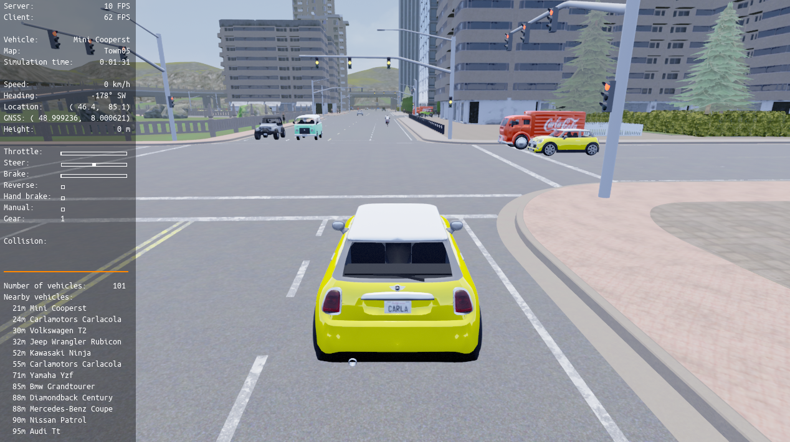
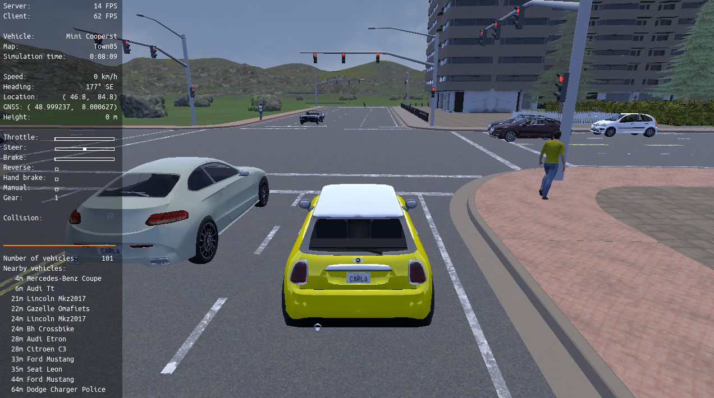

# Rendering options

There are few details to take into account at the time of configuring a simulation. This page covers the more important ones.

* [__Graphics quality__](#graphics-quality)  
	* Vulkan vs OpenGL  
	* Quality levels  
* [__No-rendering mode__](#no-rendering-mode)  
* [__Off-screen mode__](#off-screen-mode)  
	* Off-screen Vs no-rendering  
* [__Running off-screen using a preferred GPU__](#running-off-screen-using-a-preferred-gpu)  
	* Docker: recommended approach  
	* Deprecated: emulate the virtual display  


!!! Important
    Some of the command options below are not equivalent in the CARLA packaged releases. Read the [Command line options](start_quickstart.md#command-line-options) section to learn more about this. 

---
## Graphics quality

### Vulkan vs OpenGL

Vulkan is the default graphics API used by Unreal Engine, and CARLA. It consumes more memory, but performs faster and makes for a better frame rate. However, it is quite experimental, especially in Linux, and it may lead to some issues.  

There is the option to change to OpenGL. Use a flag when running CARLA.  

```sh
cd carla && ./CarlaUE4.sh -opengl
```
When working with the build version of CARLA, Unreal Engine needs to be set to use OpenGL. [Here][UEdoc] is a documentation regarding different command line options for Unreal Engine. 
[UEdoc]: https://docs.unrealengine.com/en-US/Programming/Basics/CommandLineArguments/index.html

### Quality levels

CARLA also allows for two different graphic quality levels. __Epic__, the default is the most detailed. __Low__ disables all post-processing and shadows, the drawing distance is set to 50m instead of infinite.  

The simulation runs significantly faster in __Low__ mode. This is not only used when there are technical limitations or precision is nonessential. It may be useful to train agents under conditions with simpler data or regarding only close elements.  

The images below compare both modes. The flag used is the same for Windows and Linux. There is no equivalent option when working with the build, but the UE editor has its own quality settings. Go to `Settings/Engine Scalability Settings` for a greater customization of the desired quality. 

  |  
:-------------------------:|:-------------------------:
`./CarlaUE4.sh -quality-level=Epic`  |  `./CarlaUE4.sh -quality-level=Low`

<br>

!!! Important
    The issue that made Epic mode show an abnormal whiteness has been fixed. If the problem persists, delete `GameUserSettings.ini`. It is saving previous settings, and will be generated again in the next run. __Ubuntu path:__ `  ~/.config/Epic/CarlaUE4/Saved/Config/LinuxNoEditor/` __Windows path:__ `<Package folder>\WindowsNoEditor\CarlaUE4\Saved\Config\WindowsNoEditor\`

---
## No-rendering mode

This mode disables rendering. Unreal Engine will skip everything regarding graphics. This mode prevents rendering overheads. It facilitates a lot traffic simulation and road behaviours at very high frequencies. To enable or disable no-rendering mode, change the world settings, or use the provided script in `/PythonAPI/util/config.py`.  

Here is an example on how to enable and then disable it via script.  
```py
settings = world.get_settings()
settings.no_rendering_mode = True
world.apply_settings(settings)
...
settings.no_rendering_mode = False
world.apply_settings(settings)
```
And here is an example on how to disable and then enable rendering using the `config.py`. 
```sh
cd PythonAPI/util && ./config.py --no-rendering
```
```sh
cd PythonAPI/util && ./config.py --rendering
```

The script `PythonAPI/examples/no_rendering_mode.py` will enable no-rendering mode, and use __Pygame__ to create an aerial view using simple graphics. 
```sh
cd PythonAPI/examples && ./no_rendering_mode.py
```

!!! Warning
    In no-rendering mode, cameras and GPU sensors will return empty data. The GPU is not used. Unreal Engine is not drawing any scene. 

---
## Off-screen mode

Unreal Engine needs for a screen in order to run. However, there is a workaround for remote servers with no display, or desktop users with a GPU not connected to any screen.  

The simulator launches but there is no available window. It runs in the same way as normal mode. This mode tricks Unreal Engine into running in a "fake screen".

### Off-screen vs no-rendering

It is important to understand the disctintion them to prevent misunderstandings.  

* In __no-rendering__, Unreal Engine does not render anything. Graphics are not computed.  
* In __off-screen__, Unreal Engine is working as usual, rendering is computed. Simply, there is no display available. GPU sensors return data when off-screen, and no-rendering mode can be enabled at will. 

### Setting off-screen mode

This is __only possible in Linux while using OpenGL__. Unreal Engine crushes when Vulkan is running off-screen, and this issue is yet to be fixed by Epic.  

To force the simulator run off-screen set the environment variable `DISPLAY` to empty and run CARLA using OpenGL.

```sh
# Linux
DISPLAY= ./CarlaUE4.sh -opengl
```
---
## Running off-screen using a preferred GPU  

### Docker: recommended approach 

The best way to run a headless CARLA and select the GPU is to [__run CARLA in a Docker__](build_docker.md).  

This section contains an alternative tutorial, but this method is deprecated and performance is much worse. It is here only for those who Docker is not an option. 

  <details>
    <summary><h4 style="display:inline">
    Deprecated: emulate the virtual display
    </h4></summary>

!!! Warning
    This tutorial is deprecated. To run headless CARLA, please [__run CARLA in a Docker__](build_docker.md). 

* __Requirements:__  

This tutorial only works in Linux and makes it possible for a remote server using several graphical cards to use CARLA on all GPUs. This is also translatable to a desktop user trying to use CARLA with a GPU that is not plugged to any screen. To achieve that, the steps can be summarized as:  

__1.__ Configure the server to have Nvidia working with no display.  
__2.__ Use VNC and VGL to simulate a display connected to any GPU.  
__3.__ Run CARLA.  

This tutorial was tested in Ubuntu 16.04 using NVIDIA 384.11 drivers.

* __[Latest Nvidia drivers](http://www.nvidia.es/Download/index.aspx)__ 
* __[OpenGL](https://www.khronos.org/opengl/wiki/Getting_Started)__: needed to use Virtual GL (VGL). OpenGL can be installed via apt:  
```sh
sudo apt-get install freeglut3-dev mesa-utils
```
* __[VGL](https://virtualgl.org/vgldoc/2_2_1/#hd004001)__: redirects 3D rendering commands from Unix and Linux OpenGL to the hardware in a dedicated server. 

* __[TurboVNC 2.11](https://cdn.rawgit.com/TurboVNC/turbovnc/2.1.1/doc/index.html#hd005001)__: graphical desktop-sharing system to connect remotely to the server.  

* __Extra packages__: necessary to make Unreal work.
```sh
sudo apt install x11-xserver-utils libxrandr-dev
```
!!! Warning
    Make sure that VNC version is compatible with Unreal. The one above worked properly during the making of this tutorial. 
  

* __Configure the X__

Generate a X compatible with the Nvdia installed and able to run without display:

    sudo nvidia-xconfig -a --use-display-device=None --virtual=1280x1024  

* __Emulate the virtual display__

Run a Xorg. Here number 7 is used, but it could be labeled with any free number:

    sudo nohup Xorg :7 &

Run an auxiliary remote VNC-Xserver. This will create a virtual display "8":

    /opt/TurboVNC/bin/vncserver :8

If everything is working fine the following command will run glxinfo on Xserver 7 selecting the GPU labeled as 0:

    DISPLAY=:8 vglrun -d :7.0 glxinfo

!!! Important
    To run on other GPU, change the `7.X` pattern in the previous command. To set it to GPU 1: `DISPLAY=:8 vglrun -d :7.1 glxinfo`  

* __Extra__

To disable the need of sudo when creating the `nohup Xorg` go to `/etc/X11/Xwrapper.config` and change `allowed_users=console` to `allowed_users=anybody`. 

It may be needed to stop all Xorg servers before running `nohup Xorg`. The command for that could change depending on your system. Generally for Ubuntu 16.04 use:

    sudo service lightdm stop  

* __Running CARLA__

To run CARLA on a certain `<gpu_number>` in a certain `$CARLA_PATH` use the following command:

    DISPLAY=:8 vglrun -d :7.<gpu_number> $CARLA_PATH/CarlaUE4/Binaries/Linux/CarlaUE4

!!! Note
    The `8` and `7.X` variables in the previous command depend on which were used while emulating the virtual display.

</details>

---

That is all there is to know about the different rendering options in CARLA.  

Open CARLA and mess around for a while. If there are any doubts, feel free to post these in the forum. 

<div class="build-buttons">
<p>
<a href="https://forum.carla.org/" target="_blank" class="btn btn-neutral" title="Go to the CARLA forum">
CARLA forum</a>
</p>
</div>
